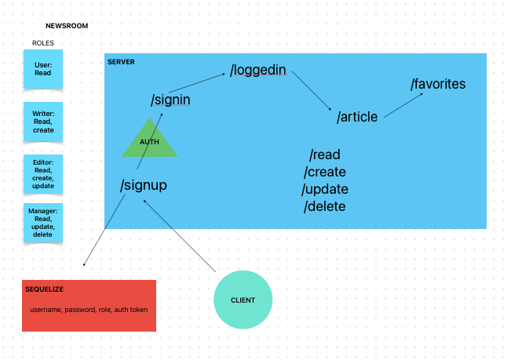

# Lab Class 09: Newsroom

Collaborators: Chris Lopez & Andra Steele

**Project**: This application attempts to showcase a Content Management System using full RESTful CRUD operations.

**Problem domain**: Newsroom is an application that simulates the hierarchy of a newsroom-- users, writers, management and all of their possible operations within the business.

This application employs the following programming concepts:

- Deployed API Auth server that renders a backend application

- Database operations utilizing an API server

- Login/auth operations that controls access to application resources

## Links and Resources

[Deployed site](https://newsroom.onrender.com/)

## To run this application

.env requirements
  - PORT=3000
  - DATABASE_URL=
  - TOKEN_SECRET=

to start

```javascript
npm start
```

to run tests
```javascript
npm test
```


